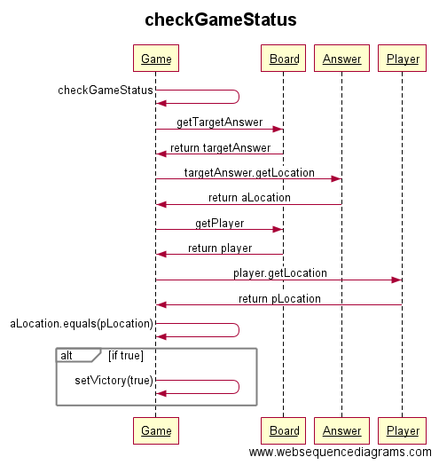

###Aiheen kuvaus ja rakenne

**Aihe**: Vuoropohjainen peli, jossa pelaajan ohjaaman hahmon tulee kulkea pelin antamaan pisteeseen kartalla alle annettujen siirtojen lukumäärän.

**Rakenne:**

Pyrin rakentamaan pelin helposti laajennettavaksi, siispä pyrin käyttämään olemassa olevia suunnittelumalleja.

**Strategy pattern:**
*Defines a family of algorithms, encapsulates each one, and makes them interchangeable. Strategy lets the algorithm vary independently from clients that use it.*
* MoveBehaviour
  * MoveCardinal
  * MoveDiagonally
  * MoveNoWay
  
Tällä rakenteella pystyn muuttamaan kartalla olevien objektien liikkumisalgoritmeja, esimerkiksi muuttamaan pelaaja-hahmon liikkumaan vaakasuoraan tai diagonaalisti. Liikkumattomat kohteet voi lukita tai vaihtaa vaikka automaattisesti liikkuviksi ajon aikana (tätä ei ole vielä alettukaan implementoida).

~~**Observer pattern:**
*Defines a one-to-many dependency between objects so that when one object changes state, all of its dependents are notified and updated automatically*~~

~~Tämän suunnittelumallin käyttämistä pohdin karttaobjektien ja kartan välisen suhteen luomiseen (loose coupling). Haen apua pajasta ennen varsinaisen toteutuksen aloittamista.~~

Käyttäjät: Pelaaja
Pelaajan toiminnot:
* päävalikon näkeminen
* pelin käynnistäminen
* pelin pelaaminen

## Luokkakaavio
Tästä piirroksesta puuttuu vielä UI-luokat selkeyden vuoksi. Ne ovat työn alla ja lisään niitä piirrokseen, kun kuvio on selkiytynyt ainakin lähelle lopullista.

## Sekvenssikaavio pelaajan ohjaamisesta ylöspäin näppäimellä 'w'

.png "sekve1")

## Sekvenssikaavio pelistatuksen tarkistamisesta

