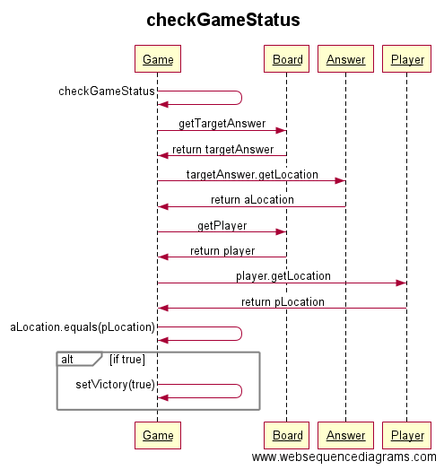

#Aiheen kuvaus ja rakenne

##Aihe:
Vuoropohjainen peli, jossa pelaajan ohjaaman hahmon tulee kulkea pelin antamaan pisteeseen kartalla mahdollisimman vähillä siirroilla.

##Käyttäjät:
* Pelaaja

###Pelaajan toiminnot:
* Pelin käynnistäminen
* Halutun tason valinta
* Pelin pelaaminen
 * Siirtojen tekeminen eri algoritmeilla ja niiden vaihtaminen
* Maalien arpominen kartalle OnOff
* Tekoälyn päättämät siirrot OnOff
* PopUpit OnOff
* Pelin tilastojen tarkastelu
* Pelin lopettaminen

## Rakenne
Ohjelman rakennetta suunniteltaessa on mietitty alusta alkaen ylläpidettävyyttä ja laajennettavuutta. Tämä ajatus on ollut korkeampi prioriteetti kuin moninaisten toiminnallisuuksien toteuttaminen "riittää, että se demoajon kestää"-mentaliteetilla. Koodi ja luokkarakenne on pyritty paketoimaan ja abstrahoimaan olio-ohjelmoinnin paradigman mukaisesti.

### Suunnittelumallit
**Strategy pattern:**
*Defines a family of algorithms, encapsulates each one, and makes them interchangeable. Strategy lets the algorithm vary independently from clients that use it.*
* MoveBehaviour
  * MoveCardinal
  * MoveDiagonally
  * MoveNoWay

Onnistuneesti implementoitu Strategy pattern, jonka avulla pystytään muuttamaan kartalla olevien objektien liikkumisalgoritmeja ajon aikana. Esimerkiksi kyetään muuttamaan pelaaja-hahmo liikkumaan vaaka- ja pystysuoraan tai diagonaalisti.

### Luokkakaavio

Luokkakaaviosta käy ilmi luokkien väliset suhteet. Paketit ovat eheitä kokonaisuuksia, ehkä Main-luokan Game-pakettiin tiputtamista lukuunottamatta. Luokkakaaviossa ei ole piirretty utils-paketin suhteita kuvan sotkemisen välttämiseksi. Niissä ei kuitenkaan mitään salattavaa ole, mutta aputyökalujen käyttämisen luonteen vuoksi niiden avaaminen kuvassa ei edesauta ohjelman luokkalogiikan ymmärtämistä. Utils-paketin IntelligentPlayer tarjoaa tekoälyn ohjaamaan pelaajaa, Randomizeria käytetään muutamissa luokissa generoimaan satunnaislukuja staattisilla metodeilla, KeyboardListener tarjoaa näppäimistönkuuntelupalvelua.

Main-luokassa luodaan GUI ja kutsutaan run().

Suurin paketti **ui** pitää sisällään graafisen käyttöliittymän toiminnallisuudet:
 - GUI:lla on useita eri paneeleita, jotka piirretään Jframelle halutun ulkonäön saamiseksi yhdistellen swingin tarjoamia eri layouteja
  - Paneelit ovat:
   - TopMenu
   - BoardPanel
   - BottomMenu
   - SidePanel
  - Joista kaksi ensin listattua käyttävät neliöiden piirtämiseen
   - RectangleDrawing-luokan staattisia metodeja
  - GUI omistaa myös instanssin PopUpWindow-luokasta, joka generoi viesti-ikkunoita pelin aikana
   - Lapsellisen helppoa lisätä ikkunoita ja niiden kautta toiminnallisuuksia myöhemmin
   
**Game-paketissa** on Main-luokan lisäksi Game-luokka, joka nivoo yhteen Boardin kautta Levelin --> ladataan pelitaso pelilaudalle (ideana, että pelihahmot liikkuvat laudalla, eivätkä tasolla). Game-luokka myös komentaa pelaajaa suorittamaan toimintoja, sekä tarkistaa pelitilanteen pyydettäessä.

**Levels-paketti** sisältää Board- ja Level-luokat, joista Level on rakennusohje Boardille. Board pitää sisällään laudalle tulevat objektit, kuten pelaajan ja maalit (answers). Luokassa on myös ASCII-metodeja toiminnan testauksen helpottamiseksi. Boardille ladataan Level, josta alustetaan pelihahmot tarjotuilla metodeilla (init). Board myös hallitsee objektien sijoittamista ja sen tueksi tarjottuja tarkistusmetodeja, kuten "onko ruutu vapaa".

**Mapobjects-paketti** (unohtui refaktoroida tuo paketin nimi, sori siitä). Sisältää abstraktin luokan BoardObject, jolla on aina oliomuuttujana Location (triviaalisti sijainti ja apumetodeja 2D:llä). Luokkaa täydentävät v.1.0. vaiheessa Player ja Answer. Abstraktilla luokalla on myös aina liikkumisalgoritmi-rajapinnan MoveBehaviour toteuttama konkreettinen toteutus, joka määrittää sallitut liikkeet.

**Movealgorithms** Täällä sijaitsee rajapintamääritelmä MoveBehaviour ja sen toteuttavat konkreettiset luokat, joita on tehty kurssia varten 3 kappaletta:
 - MoveNoWay, ei liiku
 - MoveDiagonally, liikkuu diagonaalisesti
 - MoveCardinal, liikku pysty- ja vaakasuunnassa

### Sekvenssikaavio pelaajan ohjaamisesta ylöspäin näppäimellä 'w'

.png "sekve1")

### Sekvenssikaavio pelistatuksen tarkistamisesta

