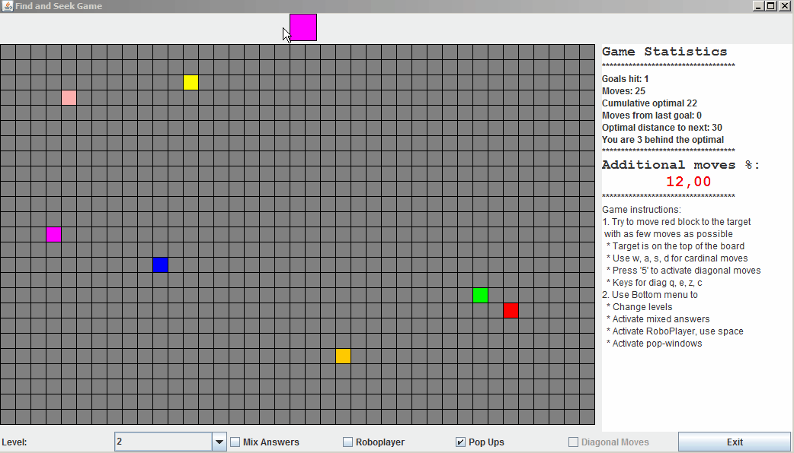
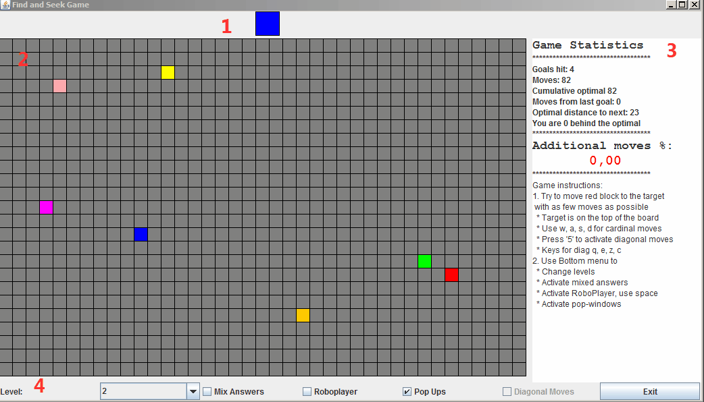

#Käyttöohjeet suomeksi
 - Sisältää tarvittavat tiedot pelin asentamiseen omalle koneelle 
 - Pelin pelaamiseen
 - Pelikenttien lisäämiseen
 
##Pelin asentaminen
1. Lataa ja Asenna [Java](https://www.java.com/en/download/)
2. Lataa ja pura [FindAndSeek.zip](../FindAndSeek.zip)
3. Suorita .jar-tiedosto käynnistääksesi peli

##Pelin tarkoitus
Pelissä on tarkoitus päästä 2-ulotteisella kartalla haluttuun pisteeseen mahdollisimman vähillä siirroilla. 

Haluttu piste näkyy pelikentällä pelilaudan yläpuolella:


Pelaajalla on käytettävissään kaksi liikkumisalgoritmia vaaka- ja pystysuunnassa tai diagonaalisesti liikkumiseen. Nämä kaksi algoritmia ovat voimassa vain yksi kerrallaan ja niiden välillä vaihdetaan painamalla näppäintä 5. Molempia on käytettävä jos halutaan saavuttaa optimaalinen askelten lukumäärä.


##Liikkuminen
Näppäimet
```
Vaaka- ja pystysuunnan ollessa aktivoituna
   w 
   | 
a- | -d
   s
   
Diagonaalisti (aktivoidaan ja deaktivoidaan näppäimellä 5)
q   e
 \ /
 / \
z   c
   ```
##Pelin käyttöliittymästä
Pelin graafinen käyttöliittymä koostuu neljästä osasta:

1. Yläpaneeli
    - Näyttää maalikohteen
2. Pelikenttä 
3. Sivupaneeli
    - Pelitilastoinnin seuranta
     - Osutut maalit
     - Liikkeiden kokonaismäärä
     - Kumulatiivinen lukema optimille maalien hakemiselle
     - Liikkeet viimeisestä haetusta maalista
     - Optimaalinen liikkeiden määrä seuraavaan maaliin (viimeisestä maalista)
     - Kuinka paljon pelaaja on kokonaisuudessaa perässä optimia suoritusta
     - Kuinka monta prosenttia pelaaja on liikkunut turhia siirtoja
    - Englanniksi pelkistetyt peliohjeet
4. Alapaneeli, joka toimii päävalikkona
    - Kenttien valinta (Level)
     - Jokainen kenttä säilyttää pelin suoritusaikana kaikki pelatut tiedot per kenttä
    - Halutaanko maalitaulujen paikat arvotuiksi osuman jälkeen (Mix Answers)
    - Tekoälyn aktivointi (Roboplayer)
     - Jokainen näppäinpainallus suorittaa robotin algoritmin mukaisen siirron (vaaka-pystysiirtoja seuraavaan maaliin)
    - Ponnahdusikkunoiden (de)aktivointi (Pop Ups)
    - Infokenttä, kumpi liikkumisalgo on käytössä (Diagonal Moves)
    - Exit-nappi pelin lopettamiselle


Peli jatkuu niin kauan, kun pelaaja haluaa pelata.
