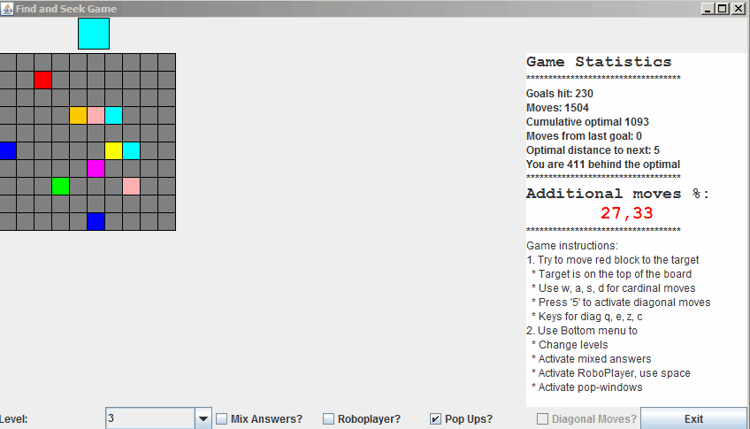

# Find-and-seek pelin testausdokumentaatio
Dokumentaation tarkoitus on kuvata sovelluksen testausta yleisesti
## Kattavuus
Suurin osa pelilogiikasta on testattu automaattisesti. Automaattisen testauksen ulkopuolelle on jätetty
- Graafinen käyttöliittymä (ui-paketti)
- Geneerisien Javan kirjastojen tarjoamien toiminnalisuuksien kapsuloivat luokat (utils-paketti)
- Utils-paketissa on myös alkeellinen tekoäly, joka on automaattisen testauksen ulkopuolella
  - Tekoäly on niin alkeellinen, että sen testaaminen on järkevää toteuttaa manuaalisesti peliä pelaamalla --> lisähyötynä testaa samalla myös käyttöliittymän toimintaa ilman näppäinkomentojen naputtelua
  
Automaattisten [Pit-testien](https://htmlpreview.github.io/?https://github.com/JaakkoV/find-and-seek/blob/master/dokumentaatio/Pit-raportti/index.html) kattavuus on hyvä, rivikattavuuden ollessa 96% ja mutaatiokattavuuden 89%. Vaillinaisuudet 100% pääsemisessä liittyvät lähinnä luokissa käytettyihin satunnaislukujen generoimiseen. Kattavuuden parantamiseksi yksi private metodi on avattu publiciksi, logiikan automaattisen testauksen mahdollistamiseksi.

## Testaus
Testejä voi pitää melko onnistuneina, sillä Pit-prosentit ja kattavuus ovat pysynyt hyvällä tasolla läpi projektin. Testien kirjoittaminen aloitettiin melko mekaanisesti käymällä luokkia ja metodeja läpi. Pit-raportin tulokset ohjasivat testien kirjoittamista ja fokuksen tähtäämistä.

Peliä on automaattisten testien lisäksi testattu pelaamalla sitä melko runsaasti NKRO-näppäimistöllä, robottipelaaja päällä.

## Bugit
Pelissä ei ole tullut pelaamisen yhteydessä juurikaan bugeja ilmi. Levelit täytyy olla oikeassa polussa suhteessa suoritettavaan filsuun, muuten tulee virheilmoitus terminaaliin. Tähän voi paremmalla ajalla kehittää esimerkiksi pop-up ikkunan heikommille käyttäjille. Virheenkäsittelyksi tuo virheilmoitus kuitenkin riittää.

Joskus robottipelaajan pelattaessa nopealla syötteellä ja arvotuilla vastauksilla, saattaa uusi target respawnata pelaajan päälle, jolloin se ei osaa liikkua "uuteen" kohteeseen. Tästä pääsee ohi deaktivoimalla robopelaaja ja painamalla mitä tahansa, paitsi pelaajan liikuttamisnäppäintä tai liikkumalla pois ja takaisin. Esiintymistodennäköisyys on erittäin pieni, joten en jaksanut loppuvaiheessa enää korjata.

Koodin vikasietoisuutta voidaan pitää manuaalisten testien perusteella erinomaisena. Ohjelma myös kääntyy ja rakentuu virheettä.

## Test-runia

